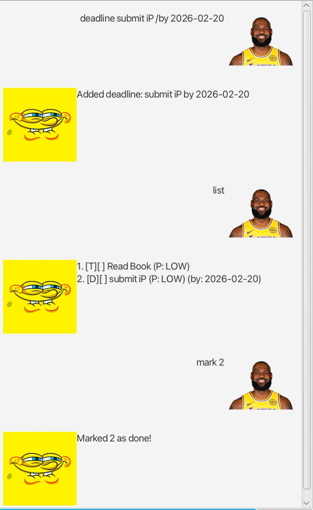

# Goat User Guide




Welcome to **Goat Chatbot**! Goat Chatbot allows you to handle your tasks in a simple and easy way!
Use Goat Chatbot to ensure you never forget a task! With features like priorities, marking tasks as completed
and input for dates, you are sure to manage your tasks well with Goat!


# Task Creation


## Adding todos

To add a todos, simply type '/todo <Todo name> <Date>'.

Example: `Read Book`

Output:
```
Added todo: Read Book
```

## Adding deadlines

To add a deadline, simply type deadline <Deadline name> /by <Date>. 
Ensure the date is in YYYY-MM-DD format. But don't fret if it isn't, Goat will prompt
you with the correct format!

Example: `deadline Submit Homework /by 2026-02-20`

Output:
```
Added deadline: Submit Homework by 2026-02-20
```

## Adding events

To add a events, simply type deadline <Event name> /from <Date> /to <Date>.
If you forget to input a from or to date, don't worry, Goat chatbot will simply prompt 
you to input the correct details

Example: `event Camp /from 2026-02-20 /to 2026-02-24`

Output:
```
Added event: Camp from 2026-02-20 to 2026-02-24
```


# Features 


## Feature: View tasks

Simply prompt the chatbot with 'list' to view all your indexed tasks summarised!

Format: 'list'

## Feature: Delete tasks

Allows you to delete tasks you no longer need to keep track of! 

Format: 'delete <index>'
- Deletes the task at the specified index

Example: 'delete 1'

## Feature: Mark and Unmark tasks

Allows you to mark or unmark tasks as completed or uncompleted!

Format: 'mark <index>' OR 'unmark <index> '
- Marks or unmarks the task at the specified index

Example: 'mark 1'
Example: 'unmark 2'

## Feature: Set Task Priority

At times, we may have tasks that are more important or urgent than others. Goat chatbot allows
you to set a priority level for each tasks. Upon creation of each task, the priority is set
to LOW by default. ALl tasks can have a LOW, MED or HIGH priority

Format: 'priority <index> <Priority>'
- Sets the task as specified index to <Priority>

Example: 'priority 2 HIGH'


## Feature: Find tasks

Allows you to search for tasks using a keyword

Format: 'find <task name> '
- Displays all tasks whose name contains <task name>
- Only the name will be searched

Example: 'find math'

## Feature: Help

If you need help while running the chatbot, simply type 'help' and
you will be prompted with the link for this user guide!

Format 'help'
- Goat will prompt the user guide website

## Close the Program

Close the Chatbot. Don't worry, your tasks are saved on your hard disk 
and will persist between restarts!

Format 'bye'

